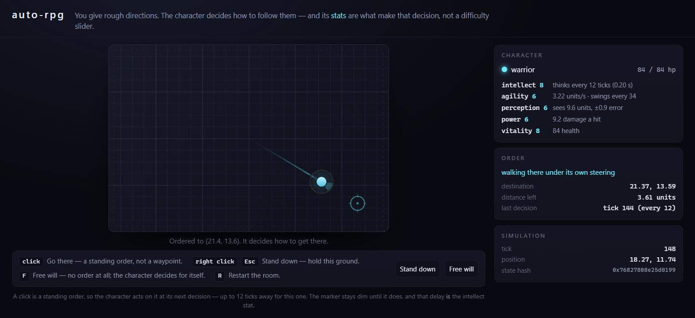

# auto-rpg

An isometric auto-battler where you give rough directions and your character
fights for itself — and where character stats are wired into the AI rather than
into damage numbers. Levelling intellect literally makes your character think
more often; levelling perception literally widens and sharpens what it sees.

Two frontends over one simulation: a browser game, and a headless lab that runs
the identical simulation as fast as the machine allows.

## Status

Milestone 2: playable. The headless sim came first on purpose — the simulation,
the agent boundary, determinism and the experiment harness are the parts that
would have been shaped wrongly by a renderer arriving early.

There is now a browser build: a generated dungeon, one character, and you click
where you want it to go. Nothing in the page does the walking. The click becomes
a standing `Order::Goto` in the sim's player-input channel, and the character's
own utility AI works out how to get there — round the masonry, when to brake, and
that a click in the rock means "as close as a body can stand". You are giving
directions to something that decides for itself, which is the whole game.

The level is 48 by 32, carved into rooms and three-wide corridors, with the
opposition already standing in it and **nothing at all marking the way out**.
Kill the last thing on the floor and the portal blooms where it died, already
open — the exit is where you earned it rather than a door you were shown on
arrival. Walk into it and the next floor is generated, deeper and better
attended, with your character carried down whole. Standing on the kill does not
take you: you have to step off and back on, or the level would end on the tick
you cleared it and you would never see the room you just won. And when your
character falls, the replacement arrives at the spot it fell — in the face of
whatever killed it. See "The floor plan" in
`DESIGN.md` for why a grid, why three tiles wide, and why routing is something
the sim is *asked* for rather than something it works out for itself.

And the rock stops eyes, not only bodies. Neither side engages through a wall, so
a monster comes *round* one rather than walking into it, and losing sight keeps
the hunt rather than ending it — bounded by `HUNT_RANGE`, eighteen units measured
along the route, because without a bound everything on the level converges on
tick one and a floor arrives as one brawl held in a large room. A blow that would
have to cross masonry does not land either: not being able to *see* something and
not being able to *hit* it are different claims, and only the second one stops the
Brute's axe, which is long enough to reach across a one-tile wall by 0.15.

And there is something to fight. `S` and `B` send in a skitterer or a brute, and
the fight runs itself under the same policies the lab evolves — no set piece, no
script. Your character opens on the **Duelist** and the monsters on the naive
`UtilityPolicy` it is measured against, and either side can be handed the other
from its own rail.

And a click is a command, not a suggestion. The feet obey a live `Goto` in the
middle of a fight while the hands go on targeting and swinging, so a character
walked out of a doorway it is losing in covers the walk as it leaves. Arrival
hands the feet back, and so does *Stand down*, which is a `Goto` at your own feet.
The wounded character obeys too: somebody who clicks while it is hurt is answering
the same question `caution` was about to answer, and the player wins.

That is a correction, and for a while it read as a pathfinding bug. `Order::Goto`
was consulted in exactly one place per policy, and that place is only reached when
nothing is in sight — so in a dungeon, where something always is, the player's
input channel had no effect during a fight at all. The route the sim was being
asked for was computed on every observation and thrown away. It was never wrong.
It was never asked.

And a drag is a path. Trace one across the floor and it becomes a queue of
waypoints — sampled about every 1.2 world units, 24 legs at most — walked in
order and held on the last; a tap is still the plain click this game has always
had, and the next plain click cancels whatever is left. Mouse, pen and finger are
one path through pointer events rather than three. Every leg is a standing
`Order::Goto` and not a rail, so it is still the character deciding how to walk
it — and the queue lives in the browser crate rather than in the sim, because one
standing order per faction is a contract and not a limitation.

And you can lose. When your character falls the room does not reset: the things
that killed it are still standing exactly where they were, and you send in a
replacement — `1` for a fighter, `2` for a rogue — to walk into the fight in
progress. Which is worth choosing rather than defaulting. A rogue thinks every
ten ticks instead of twelve and sees 14.4 units instead of 9.6, and falls over at
8 health instead of 12; the same policy runs both. Watching the same room go
differently is the shortest demonstration this project has that stats are wired
into the AI rather than into a damage number.

And they fight with **one hand**, holding one thing at a time. Inspired by *Die
by the Sword*, in 2D: a body is a size and a stat sheet, and what it fights with
is a separate choice -- a **loadout** of up to two actions, one of them in hand.
A blade takes a **line** and a **release** and runs four phases against them --
guard, windup, strike, recovery. An attack therefore *announces itself*: a
Brute spends 33 ticks with its axe cocked back before the blade is dangerous,
which is two or three chances for a Fighter to notice and answer, and none at all
for another Brute. Past the telegraph the cut commits and the line freezes. Miss,
and the recovery is a window in which the hand can do nothing at all.

That shape is deliberate and it replaced something worse. When an agent could
command the blade's bearing every tick, the optimal play — for a policy, for
evolution, and for a person with a mouse — was to hold the sword out and spin it.
Not because windmilling was strong, but because there was no instant at which an
attack *began*, and so no instant at which one could be read, dodged or punished.
Only a striking blade deals damage now, so a blade rotating outside its window is
furniture.

Damage is the blade's **kinetic energy** where it happens to connect — ½mv², with
the speed falling out of `spin × arm` — so every weapon hits hardest at the tip,
every weapon has a radius inside which it cannot hurt anyone at all, and what
happens between those two is a square rather than a line. A Brute's blow is worth
five times as much at the end of its arc as it is to a Fighter pressed against its
chest, and the first two fifths of its haft are not worth swinging at all. That is
what gives a light fighter something to do about a heavy one — and **where an
enemy's blade stops being dangerous is now something you have to judge**, blurred
by perception like everything else you can see, rather than something a policy is
told.

So there is a second mind to choose from, and it is the one your character
arrives with. The **Duelist** scores eight competing stances every time it is
allowed to think — close, trade, circle to the guard's blind side, step off the
swing plane, brace the shield on the line the blade will actually arrive along,
punish a recovery, feint, break off — and picks one, with hysteresis so it
commits instead of dithering.

It is also **a mind per thing you can hold**, which is what makes the loadout a
decision about footwork and not only about damage. A blade closes and keeps
station. A guard *never* closes — there is nothing on the other side of that walk
it could spend the ground on — and it steps out of a declared cut when there is
time to clear the arc, standing to catch the ones there is not. Legs run *away*;
that is the whole of what legs are for, and the fighter that wants to close does
it holding the blade.

Which is worth being precise about, because the sim has an opinion here that
contradicts the intuition. A blow is worth ½mv² at the radius it lands on, so
every blade hits **hardest at the tip** — backing off a step slides the contact
outward and makes the blow *worse*. There is no safe half-measure in giving
ground: either you clear the arc or you should not have moved. Both of those are
the same line of code, and it is a comparison rather than a preference.

Give that one policy three character sheets, change nothing else, and point all
three at the same Brute:

| wits            | wins | health it finishes on |
|-----------------|-----:|----------------------:|
| int 1 / per 1   |  35% |                  0.08 |
| int 8 / per 6   | 100% |                  0.56 |
| int 19 / per 18 | 100% |                  0.65 |

Same body, same weights, same opponent. A dull swordsman loses about two fights
in three and finishes the ones it wins on fumes; a capable one wins at the cost
of half of itself; a sharp one wins every time and pays a third. **That range is
the whole claim** — levelling intellect is
not a damage multiplier, it is thinking more often, and levelling perception is
not a sight radius, it is knowing where the blade will be.

And bodies have weight now. A character does not reach its walking speed on the
tick it is told to, or stop on the tick it is told to: it needs about a quarter
of a second either way, which works out to a body's width of ground before it
comes to rest. That one change moves spacing from a question about *position* —
stand at the right distance and you were safe, arbitrarily late — to a question
about *commitment*, because where a fighter will be shortly is already mostly
decided. Bodies also collide by mass rather than politely splitting the
difference, so a Skitterer can no longer shoulder a Brute off its feet.

It cost the top of the ladder something, and honestly: a sharp swordsman used to
finish on 0.82 and now finishes on 0.65, because being nearly untouchable
depended on stepping out of an arc *after* reading it, and now stepping takes
time. Dodging lost ground to blocking and out-tempoing. That is the physics
being right rather than a regression to tune away.

Two reads carry most of it. A declared cut travels along a line, and a line can
miss — so the duellist replays the cut it can see and asks whether it is even
aimed at it before deciding to defend. And a guard has *mass*: a shield still
travelling toward the bearing a blow lands on stops a fraction of what a planted
one does, so answering a telegraph early is worth something and answering it late
is worse than not answering at all.

Weapons have weight too, and it is worth being precise about what that buys,
because it is not the obvious answer. It buys **no damage at all** — not a little,
none, and the cancellation is exact. A swing is a fixed torque over a fixed arc,
so the work is the same whatever you are swinging; and the ceiling that stops a
light weapon short is how hard you can *hold on* to it, which goes as mass times
lever and cancels the mass in ½mv² term for term. Double the axe and it arrives
proportionally slower carrying exactly the same energy. Measured across a roster
whose weapons span 2.6× in mass, blade energy came out at 0.0395, 0.0383 and
0.0393 for three of the four.

What weight buys is **momentum**, where nothing cancels it — and the biggest lever
on it is not the weapon at all, it is the body being hit. One identical Brute cut
sends a Skitterer seven of its own body-widths and moves another Brute a
fourteenth of one: a hundredfold spread, where in damage it is the *same blow*.
Being heavy is a defence that no stat buys and no skill answers.

The two do not rank the roster the same way either, which is why both are in the
observation. A Skitterer's knife is dense and hafted well forward and its wielder
is feeble, so it shoves better than it cuts — a fighter that guessed how far
something would throw it from how much it hurt would guess wrong in the one
matchup where the answer matters most.

The same collision decides what happens to the two arms. Catch an axe on a
buckler and the axe barely notices while your guard is thrown wide open; catch a
knife on a tower shield and the knife comes off it hard enough to be punished.
Both numbers fall out of one calculation from the two moments of inertia, so
they cannot contradict each other — which the pair of hand-set constants they
replaced very much could, and did: the old rule had a Rogue disturbing a guard
nearly four times as hard as a Brute.

And being stopped costs *ground*. A blade reversed by a shield in a single tick
is a shove no footing holds, so a blocked cut staggers the fighter who threw it
half a walking pace out of position. A clean swing costs nothing — static
friction, the same reason a swordsman does not slide across the floor when they
cut.

The fighter who pays most for that is not the one you would guess. Recoil is a
ratio — your weapon's mass against your body's — so the **heaviest** character in
the game is the one its own axe moves least, four hundredths of a body radius,
and the lightest is a Skitterer whose dense, forward-hafted knife costs it 1.6 of
its own radii on one committed cut: four fifths of its own width, forty times what
the Brute pays. A Skitterer that swings is a Skitterer that is somewhere else
afterwards. Its fighter can see that number before it commits, which is the whole
point of it being in the observation.

Walking into somebody splits on the mass ratio too, so how much the other body
weighs relative to yours is a thing your character can now judge — badly, if its
perception is poor, since a Brute is denser than it looks and a Skitterer lighter.
What it does *not* get is a body-check. That was built and measured and taken back
out: shoving only beats swinging where swinging has stopped working, and in this
roster it never quite does, because bodies are wider than the gap. A Brute with a
Skitterer pressed against its chest is down to a seventh of its best blow and that
is still better than a shove.

And you can take over. Three independent switches, `C`, `V` and `X` —
**Movement**, **Action** and **Aim**: the feet, the choice of what to hold, and
the attack. WASD steers; the mouse aims the line and **click to cut** — one
click, one attack, with the same windup and the same recovery the AI pays. `1`
and `2` change what is in your hand, and the swap costs the same ticks it costs
the AI. Whichever of the three you do not hold, the AI keeps doing — on its own
reaction clock, because that is a stat.

Independent means all eight combinations, including the interesting one:
**Aim** without **Action** hands you the cuts and leaves the weapon to the
character, so you are throwing blows something else decided to arm you for.

And the numbers match. `web.wasm` and the native lab produce the same 64-bit state
hashes for the same scripted runs, so cross-target determinism is tested rather than
merely designed. The exact current pins and the stale value formerly copied here are
tracked in the [hash registry](docs/reference/hashes.md#golden-registry).



The destination marker stays dim until the character actually acts on the click.
That gap is up to twelve ticks, and it is not input lag — it is the intellect
stat, which is the same number the HUD is showing you.

And you see what your character sees. The floor is remembered once looked at:
black where it has never been seen, dim where it has been and is not now, lit
where it is in sight, and a descent forgets all of it. A monster that steps behind
rock does not blink out — it fades over about 400 ms and leaves a dashed outline
for another two seconds, at the pose it was last in rather than at the position it
actually has, because an outline tracking a body through stone is a wallhack with
a fade on it. Two things ignore the fog on purpose, and both read as bugs if
nobody says so: the portal is drawn whether you have seen it or not — which now
costs almost nothing, since it only exists once the floor is clear and there is
nothing left to discover it *from* — and `left N` counts every monster alive,
because it is the level's clear condition and not a perception.

`G` cycles three views, or the selector beside **Keys**. `[world]` is the room
as it looks: a 2:1 isometric room, where the rock stands up as blocks with a lit
top and shaded sides, bodies are upright billboards planted on flat ground
shadows, and something standing behind a block is behind it. It paints the art and
not the numbers behind it — the weapon in hand, the amber line while a body winds
up, a health bar while it is fighting or hurt, and one faint ring on the floor
where the sim's collision circle really is, which is there because a page must
never draw a shape it will treat as hittable and then hide where the edge is. The
sight circles, the facing wedge and the dashed weapon-range ring are not drawn.
`[tactical]` drops the art — silhouette, head, drop shadow, body gradient,
flagstones, the vignette — for a disc and a facing wedge on flat ground, and turns
every readout back on: limb, reach rings, vision discs, health, arrows, damage
numbers, callouts, trail, destination, route and portal. `[dev]` is tactical bodies
with no fog at all and the tick strip open, which is one intent stated once instead
of twice — the chevron button that used to open that strip is gone. Both of those
are the same room seen flat from above, and staying top-down is deliberate rather
than unfinished: they are the A/B control for the isometric conversion, so
anything that changes in one projection and not the other is something the
projection did. The scale grid, one line every four units, stays in all three —
under iso it runs on the tile diagonals, which are those same world lines seen
from the new angle.

And `Space` freezes it, or the button beside **driving**. The world stops and
nothing else does: rendering, the camera, the zoom, the hover readouts and *every
order control* keep working, so a room can be read over and handed a path while it
is standing still. In a game whose only input is a standing order, a pause you
cannot give orders during would be a screenshot.

## Layout

```
crates/fx       deterministic math: 16.16 fixed point, vectors, angles, PCG32
crates/sim      the game: world, tick, observations, actions, replay
crates/policy   agent policies + the run harness
crates/lab      headless experiment CLI
crates/web      the browser boundary: a hand-rolled wasm ABI, no wasm-bindgen
web/            the legacy Canvas page and the v2 diagnostic HTML entry
client/         the TypeScript v2 Worker protocol and diagnostic client
tools/          generators, the legacy-page server, and repository checks
docs/plans/     working plans, updated in place as sessions complete
```

The deterministic core currently has no external dependency. `fx`, `sim`, and
deterministic `policy` code accept only local deterministic crates and `std`;
presentation, host, asset, and explicitly nondeterministic learning code may use
audited exact dependencies outside authoritative state. The full boundary is in
[the determinism contract](DESIGN.md#the-determinism-contract).

## Getting started

To play it:

```
rustup target add wasm32-unknown-unknown          # once
node tools/serve.js                               # legacy Canvas page only
```

Then open the printed URL. Click to send the character somewhere, or drag to trace
it a path; right-click or `Esc` to make it hold its ground; `F` to withdraw the
order entirely and watch it decide for itself; `S` and `B` to send in a skitterer
or a brute; `1` and `2` to choose which of the two things you are carrying is in
your hand; `C`, `V` and `X` to take its movement, its choice of kit or its aim; `E`
for the Hero rail, which stays live after your character falls so you can dress the
next one — and keeps the attributes you set rather than handing them back to the
archetype; `Space` to freeze the world; `G` to cycle how the room is drawn; the
wheel to zoom; `R` to open a fresh room. The `?` in the corner holds the same list,
kept in the page rather than here. A server is needed because a `file://` page
cannot instantiate wasm — that is the only reason.

To run the shipped v2 Worker diagnostic instead:

```text
npm ci                                            # once, or after lockfile changes
npm run dev                                       # builds release wasm, starts Vite
```

Open the Vite origin at `/v2.html`. The diagnostic's TypeScript module graph requires
Vite; `tools/serve.js` serves only the classic Canvas files and cannot serve v2.
Both development and production host the v2 entry and wasm artifact at the origin
root as `/v2.html` and `/web.wasm`. See the
[browser runtime](docs/architecture/browser-runtime.md#worker-renderer-path) for
the ownership boundary.

Plain `/v2.html` loads the current pinned, textured representative-room GLB and keeps
the Worker controls active. Add `?room=procedural` for the explicit greybox removal
route; fixed stress URLs continue to select their own room. The authored route passed
the owner's minimum legacy-parity visual review; foreground performance and the
longer-term `CONCEPT.png` direction remain open in the
[room matrix](docs/performance/v2-room-matrix.md#visible-review-record).

The room is the page. The camera is centred on your character and clamped to the
walls, so walking into a corner stops the view rather than showing you the void
past it — and everything that is worth reading but not worth watching lives
behind `Tab` instead of in a sidebar that used to leave the arena a postage
stamp on a 1080p display.

To work on it, start with `cargo test`. The full contributor command set and the
checks required before a change lands are in [AGENTS.md](AGENTS.md#commands).
`lab verify` proves re-run and replay equality, `lab duel` compares policies, and
the benchmark commands measure open and carved scenarios. Their dated methods,
hardware, results, and corrected interpretations live with the
[performance evidence](docs/performance/README.md), not in this run path.

## The three decisions everything else follows from

The sim is isolated from the renderer, its authoritative arithmetic is fixed point,
and replays record decisions rather than rerunning policies. Those choices make a
run portable without requiring a future learned policy to be portable too. The
[architecture overview](docs/architecture/overview.md), [determinism
contract](docs/reference/determinism.md#contract), and [replay
decision](docs/decisions/0002-record-commands-in-replays.md) own the current
boundaries and their rationale.

## The agent boundary

`Observation` in, `Command` out. A hand-authored utility AI, a neural policy, a
recorded log and a human all enter through the same door. See the current
[policy boundary](docs/architecture/policy.md) for the flow and the [command
reference](docs/reference/commands.md) for the exact layouts and standing inputs.

## Stats drive the AI, not the network

One trained policy will serve every character build. A dim character is not
running a worse network — it is running the same network on a blurrier picture,
less often. That is legible on a character sheet, cheap to balance (these are
knobs, not retraining runs), and it gives the lab an obvious axis to sweep.

The exact observation fields and current command layout belong to the [command
reference](docs/reference/commands.md); the gameplay rationale and progression
ownership live in [combat design](docs/design/combat.md) and [progression
design](docs/design/progression.md).

Perception earned a second job when combat became geometric, and the split it
settled into is the interesting part. *That* an enemy is winding up arrives
**exact** — a blade hauled back over a shoulder is not a subtle cue, and anyone
can see a blow is coming. *When* it lands and *along which line* are blurred
hard. A dim character is not blind to the attack. It is late, and it guesses the
line wrong, which is a much more interesting way to lose than not noticing. The
measured examples and their provenance live in the [combat
evidence](docs/performance/evidence/2026-08-combat-mechanics.md).

## Where this goes next

The current implementation roadmap is the [v2 plan](docs/plans/v2-00-overview.md).
Plans are temporary working documents, not claims about shipped behavior. Current
limitations and open investigations remain with the design, architecture, and
reference documents linked from [DESIGN.md](DESIGN.md).

See [DESIGN.md](DESIGN.md) for the rules that keep the determinism guarantee
true.
