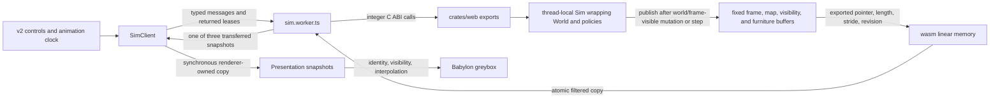

# Browser runtime

**Purpose:** Describe the v2 GPU browser entry, its wasm ownership, rendering boundaries, the arena's published and invented geometry, room loading, memory handshakes, and visibility data.
**Status:** current
**Canonical source:** [`crates/web/src/lib.rs`](../../crates/web/src/lib.rs), [`client/src/runtime/sim.worker.ts`](../../client/src/runtime/sim.worker.ts), [`client/src/runtime/sim-client.ts`](../../client/src/runtime/sim-client.ts), and the [renderer contract](../reference/renderer-contract.md#renderer-owned-snapshot-boundary)
**Update when:** The wasm ABI, buffer ownership, browser execution context, frame parser, visibility publication, what the arena's two dresses draw, or the rendering backend changes.

A browser can open one thing. The studio at
[`web/index.html`](../../web/index.html) is built by Vite, is the build's single
Rollup input, and is one hash-routed application: `#/game` owns the legacy simulation
behind a module Worker and renders disclosed snapshots as the procedural Babylon
greybox or the pinned representative room, with pinned authored Fighter and Brute
dresses when their independent validation succeeds, while retaining lifecycle,
command, buffer, and backend diagnostics; `#/arena` takes two loadouts and a seed,
records the fight
they describe in a Worker of its own, and scrubs the transferred pose, region and
combat-event buffers -- and still replays a recorded `lab trace` file through the same
`FightSource` seam when one is named by `?trace=`.

**The playable Canvas game beside it was retired in the embodied-combat work**, and
its absence is why this document now describes one entry rather than two.
`web/legacy.html` loaded `draw.js`, `rig.js`, `assets.js` then `main.js` on the
browser's main thread; four classic scripts sharing top-level state are not a module
graph, so it stayed out of the Rollup input and out of `dist/` for its whole life. It
was never built and never executed by a test, and its one live cost was an obligation
to mirror every frame-ABI change into a page that shipped nowhere. The studio was a
presentation proof beside a playable entry; it is now the entry.

## Current flow

No two entries share a live wasm instance: `#/game` and `#/arena` each construct one
inside a Worker of their own, each holding its own authoritative `World`, and the hash
router mounts one route at a time. The `#/game` route's current contract is the
[worker lifecycle and state machine](../reference/worker-protocol.md#lifecycle-and-terminal-state).

The browser owns pacing and calls the exported `step(n)`. The boundary advances
exactly the requested number of ticks; the page caps catch-up work rather than making
simulation history depend on a timer inside wasm. Input exports accept integers --
for example, thousandths of a world unit -- and map them into fixed-point values.
Exports that mutate the authoritative world or otherwise change the published frame
republish before returning. `set_input` only stages controls for the next `step`, and
the spawn-template setters only edit a future unit specification; neither publishes
until that staged state is consumed or applied. The exports are total when called
before `init`: an absent world returns a neutral value instead of trapping the wasm
instance.

The studio opens in mouse-order mode: direct feet are released, no standing order
means stationary local idle, and a floor click supplies the world-space `Goto` that
reenables policy navigation. Direct Movement is opt-in. W/S and A/D cross as
normalized local forward/strafe axes; held Q/E crosses as a signed thousandths turn
request. The browser owns no duplicate heading: the Rust host integrates 512 raw
binary-angle units per simulation tick (an exact quarter-turn in 32 ticks), rotates the local axes from authoritative
legacy facing, and restores that exact facing after movement. Releasing Movement
submits zero before returning the feet to mouse orders. Equipment buttons and the
1/2 keys take slot authority before issuing the normal paid swap request.

The authoritative simulation is the `World` held by the browser crate's
thread-local `Sim`. The browser crate also owns presentation-only traces, flashes,
run/portal state, route convenience, and visibility memory. Those additions do not
become simulation state merely because they live in the same wasm module.

## Fixed publication buffers

The `thread_local!` block in [`crates/web/src/lib.rs`](../../crates/web/src/lib.rs)
contains four fixed-capacity publication arrays:

- `FRAME: [f32; FRAME_MAX]` for the header followed by live unit, shot, and event rows;
- `MAP: [u8; MAP_MAX]` for solid/open tiles;
- `VIS: [u8; MAP_MAX]` for unknown, remembered, and currently visible tiles; and
- `FURNITURE: [u8; FURNITURE_MAX * FURNITURE_STRIDE]` for door and torch records.

The live frame length, map shape, and furniture record count live beside the arrays
in scalar cells. Map, visibility, and furniture revisions are fields of `Sim`, while
visibility length is derived from the current map shape. A fixed array cannot
reallocate its own address. That matters because growing wasm linear memory detaches
JavaScript typed arrays, and a moving `Vec` at this boundary would turn an otherwise
valid view into stale memory.

A fifth fixed array is inward-only: the 57-byte versioned submitted-command
scratch buffer. The host writes and drops its short-lived view before calling the
submit export; Rust copies the complete buffer before validation or mutation. It
does not change the frame layout or any publication revision.
Domain-aware digest exports and the isolated versioned-command test initializer let the
wasm equality check exercise that inward buffer without changing legacy `init` or
the legacy state-hash exports.

`Sim::write_frame` writes the packed `f32` frame. It always refreshes header values,
skips dead entity handles, caps each variable section, and returns the live span.
Rows can shift after a death, so consumers use the stable handle defined by the
[frame ABI reference](../reference/frame-abi.md#identity-and-numeric-representation)
rather than treating a row as identity.

The ABI layout is mirrored in Rust, in `tools/wasm_check.js`, and — by way of
`emit_abi.rs` — in the generated `client/src/protocol/abi.generated.ts` that the
snapshot parser reads. `main.js` mirrored it as well until it was retired with the
Canvas page; the standing obligation to hand-edit a parser in a file no build included
is precisely what that retirement bought back. At boot the page validates the
compatibility handshake defined by the
[frame ABI reference](../reference/frame-abi.md#compatibility-rules) and refuses to
draw on disagreement. Frame, map, visibility, and furniture accessors, tick/hash
exports, registry lookups, and integer command exports make up the hand-rolled
boundary. The crate uses neither `wasm-bindgen` nor browser host types.

## Direct views and retained copies

**This section describes the retired Canvas page and is kept because the rule it
records outlived it.** `frameView()`, `parseFrame`, `readMap`, `readVis` and
`readFurniture` lived in `web/main.js` and exist nowhere now; what they demonstrated
still governs every consumer of this boundary, and `tools/wasm_check.js` and
`client/test/wasm-memory.test.mjs` are where it is enforced today.

`frameView()` constructed a live `Float32Array` over exported linear memory for the
current frame. From the moment that view was created until parsing finished, code
could not call back into wasm: a call may mutate the buffer or grow memory, and
growing it detaches every existing view. `parseFrame` therefore performed arithmetic
only and wrote into long-lived JavaScript pools, and the page re-derived the live
frame view rather than retaining it.

The floor map, visibility field, and furniture records survive across frames, so
`readMap`, `readVis`, and `readFurniture` copied their short-lived `Uint8Array` views
into JavaScript-owned arrays. Revisions decide when the level bake must be rebuilt.
That page read a direct-memory ABI, with the copy made by the consumer rather than
posted by a worker or serialized by Rust; the studio moved that copy into a Worker,
which is the difference the section below describes.

## Worker renderer path

Only [`sim.worker.ts`](../../client/src/runtime/sim.worker.ts) fetches and instantiates
wasm for the `#/game` route. It reads all publication scalars before constructing wasm
views, makes no further wasm call while copying, and hands the four publications to
the pure `SimWorkerHost`. The host validates and filters them into a checked-out
snapshot from an exact three-buffer pool, then transfers the complete buffer in one
message. `SimClient` retains at most the newest snapshot and returns the previous
lease. The exact [message and scheduling contract](../reference/worker-protocol.md#messages-and-command-scheduling)
and [snapshot ownership contract](../reference/worker-protocol.md#snapshot-layout-and-buffer-ownership)
are durable reference authority.

The `#/game` route sends init, reset, pause, advance, goto, withdraw, spawn,
control-ownership, and live-input requests and
displays epoch, tick, sequence, queue, coalescing, buffer ownership, and backend
counters. Direct Movement ownership defaults off with zero input, leaving mouse
orders authoritative. Mouse aim defaults on; W/S move forward/back, A/D strafe,
and Q/E turn relative to hero facing while
Movement is owned. Primary press/release supplies the attack edge and 1/2 request
loadout slots. During each snapshot callback it synchronously copies the live leased
views into renderer-owned immutable presentation records. Babylon sees only those
copies. The exact [copy boundary](../reference/renderer-contract.md#renderer-owned-snapshot-boundary),
[presentation identity](../reference/renderer-contract.md#presentation-identity),
and [interpolation timeline](../reference/renderer-contract.md#interpolation-timeline)
are durable reference authority.

The route also owns two observational controls that never cross the Worker boundary.
An always-visible 500 ms rAF meter reports rounded FPS and the worst raw interval in
the same window; mount and return-to-visible reset it so hidden time is not presented
as a long frame. One renderer-owned registry supplies World, Geometry, Top Down,
First Person, Free, and Dev. `G` cycles forward, Shift+G cycles backward, and the
selector names any row directly. All six reuse one Scene, Worker, snapshot, and
presentation identity registry. World and Geometry share an 8% screen dead-zone with
damped isometric follow; Top Down and Dev use the same camera owner overhead; First
Person places it at the hero eye and hides only that hero's self-obscuring head and
torso; Free owns orbit/pan/zoom and refuses simulation commands. Leaving a special
view restores fixed follow rather than constructing another renderer or Worker.

The procedural scene uses a right-handed `(x, elevation, y)` mapping, a fixed
isometric camera, instanced known tiles, generational unit meshes, and snapshot-local
shots and events.

**Two world-to-scene mappings exist, they are mirror images, and neither may be copied
into the other's page.** The `#/game` greybox maps world `(x, y)` to Babylon `(x, z)`
with height on `y` and yaw negated. The `#/arena` capsule panels map world
`(x, y, height)` to Babylon `(x, height, -y)` and do **not** negate yaw. Each is the
orientation-correct mapping against its own 2D authority, which is why the disagreement
is deliberate rather than a defect: `web/main.js` drew `+y` down the screen until it
was retired with the Canvas page, so the greybox's determinant `-1` map reads the same
way round as the page it was written to proxy, and a cylinder has no chirality for a
reader to catch it out on;
[`client/src/fight/view.ts`](../../client/src/fight/view.ts) draws `+y` up and argues
why at length -- `actuator::shoulder` puts `LimbSlot::LeftArm` on the +90-degree side,
which is a body's anatomical left only in a right-handed frame with `y` up -- so the
rotation rather than the reflection is what a body carrying a shield in one named hand
needs, or the plan panel and the 3/4 panel disagree about which hand holds it.
The domains do not overlap: the greybox draws `PresentationSnapshot` units for `#/game`,
the arena draws `Pose` capsules for `#/arena`, and no scene is built from both.

WebGPU is attempted in automatic mode; a recorded support or
initialization failure falls back to an explicit WebGL2 context. Backend loss stops
the renderer rather than silently switching during a run. The exact
[backend lifecycle](../reference/renderer-contract.md#backend-selection-and-loss)
is shared by the page and its diagnostics.

For local studio development, `npm run dev` first builds the release web wasm and then
starts Vite. Open `/` on the printed Vite origin. **Vite is the only development
server**: the dependency-free `tools/serve.js` was written for the Canvas page and was
retired with it, having no bundler and so no way to resolve the studio's TypeScript
module graph beneath `client/`. A server is in the loop at all only because a `file://`
page cannot instantiate WebAssembly.
Development and production both reserve the origin-root URLs `/` and
`/web.wasm`; the Worker fetches the latter by absolute URL. `npm run build` emits
those deployable files as `dist/index.html` and `dist/web.wasm`, so mounting the output
under a subpath without rewriting that contract is unsupported. Routes carry their own
query, so a deep link is `/#/game?stress=greybox&renderer=canvas` rather than a query
on a page.

## The arena's two dresses

The arena's three viewports carry two dresses of one scene, chosen by the
`[Texture]`/`[Geometry]` pair under the 3/4 panel. **The mode is a property of the
scene rather than of a panel**, so all three viewports change together: pressing a
button swaps which meshes hang under the rig, enables or disables the environment and
the shadow casting, and moves no camera and rebuilds no engine.
`[Geometry]` is the control and draws only shapes the simulation published -- five
region capsules at their published radii, hand spheres, weapon capsules and the shield
face rebuilt through `shieldCorners` -- flat, unlit, on a bare grid.
`[Texture]` dresses the same published rows in PBR under a warm upper-right directional key (diffuse `[1, 0.68, 0.42]`, specular `[0.36, 0.23, 0.15]`, intensity `1.65`), a restrained umber hemispheric fill (diffuse `[0.30, 0.25, 0.20]`, ground `[0.025, 0.020, 0.018]`, intensity `0.28`) and a `ShadowGenerator`, and fills between them with the named
inventions the table below lists, each one argued in
[`client/src/arena/geometry.ts`](../../client/src/arena/geometry.ts) beside the code that
makes the choice. Nothing invented
feeds back: cosmetics never reach `Scenario`, `World`, a submitted command, a replay or
a hash domain, and no animation creates a hit. The gait is a pure function of the tick
and the published speed rather than an integral, because the arena scrubs and a picture
whose content depends on playback history cannot be used to check a geometry claim.
**No visual on the legs may be read as evidence about footwork**, and `[Geometry]` is
one keystroke away for exactly that reason. In `[Texture]`, a successfully validated
Fighter or Brute asset replaces the primitive proxy with an independent skinned clone
hung from those same named nodes. Cosmetic clips are sampled from published stride or
contact/event state, then the named endpoints are restored from the published rig so
animation cannot move authoritative hands, sockets, or regions. If loading or cloning
fails, the primitive textured proxy remains the dress.

The line between the two dresses is not "how much detail" but **where authority stops:
published quantities place things, and invented quantities only fill between them.** A
hand is where the pose says. An elbow is a guess. A knee is a guess about a guess.

| part | source |
|---|---|
| body position, yaw | published |
| head | published capsule -- degenerate, its extent is `radius` |
| torso | published capsule |
| hands | published |
| weapon hilt and tip | published |
| shield centre, normal, extents | published; the thickness the scene draws is the pose's own `ShieldFace` row rather than the header's `Carried` entry |
| elbow | invented -- two-bone IK between the published shoulder and the published hand |
| legs | invented -- one published capsule split into two, gait amplitude from published body velocity |
| wrist orientation | invented -- derived from the weapon segment, which is published |

The arm capsule runs shoulder to hand and its own length is the extension, so the IK has
a real root and a real target and only the bend plane is chosen. The legs are the
weakest claim on the page: one capsule, no stride, no per-foot contact, so a walk cycle
driven from body speed desynchronises from a footfall that does not exist.

**`#/arena` is a spectator**, and nothing on the page drives a body: the fight is decided
by two loadouts, two policies and a seed before the first frame, and the panels only
scrub what was recorded. The two eye-height cameras are there anyway. They exist because
the design target the off-arm decision was made against is first-person human control of
a single hero rather than a spectator's camera -- the
[off-arm correction](../reference/articulated-mechanical-gate.md#correction-2026-08-10-the-off-arm-holds-one-pose)
carries that argument -- so driving a body from this page is what they are eventually
for, and it needs an input path that exists in no layer. Widening past two fighters is
the cheaper debt of the two: `MAX_POSES` is 64 and nothing below the panels assumes two,
but the picker, the stage layout and the two first-person viewports all do.

## Visibility authority

Fog is published by the wasm boundary rather than reconstructed from render-space
geometry. `Sim::refresh_vis` asks the authoritative dungeon which tiles the hero can
currently see, folds that result into per-floor memory, and writes one byte per tile:
`0` unknown, `1` seen earlier, `2` visible now. The same publication pass computes the
unit row's `visible` flag from the hero's position, sight range, and dungeon line of
sight. Visibility refresh happens before `write_frame`, so tile fog and body flags
describe the same hero position.

This fog is presentation state derived from the authoritative world. It is absent
from `World::state_hash`, and headless lab runs do not compute it. World view consumes
it to hide unknown space and dim remembered space. The GPU World, Geometry, Top Down,
First Person, and Free modes keep that same fog; Dev alone disables it deliberately.
The renderer is not entitled to replace the
published answer with a camera frustum or its own ray cast. The v2 renderer applies
the same [subsystem presence gate](../reference/renderer-contract.md#visibility-and-subsystem-presence)
to meshes, shadows, labels, effects, audio, picking, and debug records.

Plain `#/game` and the explicit `room=representative` route load the pinned semantic `GLB` kit under the
exact [disclosure mapping](../reference/room-asset-contract.md#authored-room-disclosure-mapping)
and [scene-bound loader lifecycle](../reference/room-asset-contract.md#loader-lifecycle-and-failure).
The entry dynamically imports the glTF loader chunk only after it has selected that
authored room; the chunk remains absent from modulepreloads and the initial static
import closure. Explicit `room=procedural`, fixed-stress greybox, and Canvas startup
do not request it. The root-host runtime allowlist serves only the
room `GLB` and semantic sidecar; the validator report is checked build/evidence
provenance and is deliberately not deployed. Asset load completes before input,
Worker initialization, or capture readiness, and failure is terminal for the route.

**`#/arena` is a second consumer of that kit and the one place a missing asset is not
terminal.** Its `[Texture]` mode loads the same authored room `GLB` and sidecar through
`render/room-assets.ts`, behind the same pins, the same bounded fetch and the same
validation, and imports the loader chunk only on the first press -- so `[Geometry]`
requests it no more than `room=procedural` does. What differs is the failure: the arena
degrades to a procedural floor and says which one is on the screen on the panel's own
label, rather than taking the mode down. The rule it departs from is the reason for the
departure. `#/game?room=representative` is a reader asking for the authored room by
name, and answering with a different room would answer a question nobody asked; the
arena's `[Texture]` asks for a lit fighter, and the room is the backdrop it stands in.
The arena instances only floor and wall roles, lays them one tile outside the published
arena rectangle so masonry never stands where a body may, and adds only walls as shadow
casters. It creates no door, torch, light, pick or debug record from the kit, so the
disclosure mapping has nothing to disclose there.

The GPU `#/game` route imports and attempts the pinned combatant loader during renderer
initialization. It verifies bounded bytes, hashes, exact sidecar/container closure, skeletons,
bones, clips, materials, transforms, and bounds before publishing hidden shared source
archetypes. Fighter and Brute instances receive independent cloned skeletons; unsupported
kinds and non-abort load/clone failures retain the procedural figure. The same fog,
generation, shadow, pick, effect, audio, debug, reset, and disposal ownership applies
to either dress. An abort remains terminal because it belongs to renderer teardown,
not graceful asset degradation.

The arena loads the same combatant container lazily and once, together with its room,
on the first `[Texture]` request; `[Geometry]` never requests either asset. Authored
arena meshes follow published region, arm, weapon, shield, contact, health, and gait
rows, including severance visibility and first-person self-occlusion. A load or clone
failure keeps the procedural textured proxy. Neither browser path writes animation or
asset state back into a command, simulation, replay, or hash domain.

The current authored assets pass loader and lifecycle contracts. Stable four-sided
wall identity closes the automated topology defect: disclosure retains existing face
objects, every face has masonry depth, and it meets a bounded dark ground and cliff
skirt instead of empty canvas. One opaque, non-pickable roof block covers each VIS 0
cell and reconciles away only when that cell is published. A projected near face
overlapping the hero eases to 22% alpha, leaves the shadow set while translucent, and
restores the same object; no camera quadrant deletes a side. Foreground corner-walk
evidence remains owed, so the 2026-08-17 owner screenshot remains the last visible
wall verdict rather than being silently erased.
The same room owner consumes `DUNGEON_OBJECT_V1`: physical door leaves pivot at their
published collision hinge, torch yaw covers all four wall faces, and barrel, pottery,
web, and water state reconciles by stable object identity. A destruction edge retires
intact art once and replaces it with presentation debris; fog retirement removes its
mesh, light, pick, shadow, and animation state together. Legacy door/torch furniture
is suppressed whenever the physical publication is present, preventing duplicate
objects at one authoritative location.
The Fighter is still not readable as a person at gameplay scale, the ground cue
intersects the floor, and torch/material treatment remains schematic and repetitive.

## Source anchors

- Fixed publication pools: [`thread_local!`](../../crates/web/src/lib.rs#L1695)
- Packed frame writer: [`Sim::write_frame`](../../crates/web/src/lib.rs#L4390)
- Hand-written wasm exports: [`init`](../../crates/web/src/lib.rs#L5425)
- Worker adapter and atomic scalar phase: [`readPublication`](../../client/src/runtime/sim.worker.ts#L94)
- Pure protocol host: [`SimWorkerHost`](../../client/src/runtime/sim-worker-host.ts#L55)
- Main-thread lease owner: [`SimClient`](../../client/src/runtime/sim-client.ts#L122)
- Greybox unit mapping: [`ActorPresentation.#pose`](../../client/src/render/actors.ts#L304)
- Arena capsule mapping: [`scenePoint`](../../client/src/arena/geometry.ts#L53)
