# Browser runtime

**Purpose:** Describe the Canvas and v2 GPU browser entries, their wasm ownership, rendering boundaries, room loading, memory handshakes, and visibility data.
**Status:** current
**Canonical source:** [`crates/web/src/lib.rs`](../../crates/web/src/lib.rs), [`web/main.js`](../../web/main.js), [`client/src/runtime/sim.worker.ts`](../../client/src/runtime/sim.worker.ts), [`client/src/runtime/sim-client.ts`](../../client/src/runtime/sim-client.ts), and the [renderer contract](../reference/renderer-contract.md#renderer-owned-snapshot-boundary)
**Update when:** The wasm ABI, buffer ownership, browser execution context, frame parser, visibility publication, or rendering backend changes.

Two browser entries ship. The game at [`web/index.html`](../../web/index.html) is a
classic-script Canvas application with no JavaScript build step. It loads `draw.js`,
`rig.js`, `assets.js`, then `main.js` in dependency order, and `main.js` fetches and
instantiates `web.wasm` on the browser's main thread. The v2 entry at
[`web/v2.html`](../../web/v2.html) is built by Vite and owns the same legacy
simulation behind a module Worker. It renders disclosed snapshots as the procedural
Babylon greybox or the pinned representative room while retaining lifecycle,
command, buffer, and backend diagnostics.
It is a presentation proof rather than a replacement for the playable Canvas entry.

## Current flow

```mermaid
flowchart LR
    I[Legacy DOM input and animation clock] --> J[web/main.js]
    D[v2 controls and animation clock] --> K[SimClient]
    K -->|typed messages and returned leases| W[sim.worker.ts]
    W -->|integer C ABI calls| E[crates/web exports]
    J -->|integer C ABI calls| E
    E --> S[thread-local Sim wrapping World and policies]
    S -->|publish after world/frame-visible mutation or step| B[fixed frame, map, visibility, and furniture buffers]
    B -->|exported pointer, length, stride, revision| M[wasm linear memory]
    M --> V[main.js typed-array views and copies]
    M -->|atomic filtered copy| W
    W -->|one of three transferred snapshots| K
    K -->|synchronous renderer-owned copy| R[Presentation snapshots]
    R -->|identity, visibility, interpolation| G[Babylon greybox]
    V --> P[frame parse and level bake]
    P --> C[Canvas display list and HUD]
```

The two paths never share a live wasm instance. Each page owns its own instance and
authoritative `World`; only one page is active in a browsing context. The v2 entry's
current contract is the [worker lifecycle and state machine](../reference/worker-protocol.md#lifecycle-and-terminal-state).

The browser owns pacing and calls the exported `step(n)`. The boundary advances
exactly the requested number of ticks; the page caps catch-up work rather than making
simulation history depend on a timer inside wasm. Input exports accept integers --
for example, thousandths of a world unit -- and map them into fixed-point values.
Exports that mutate the authoritative world or otherwise change the published frame
republish before returning. `set_input` only stages controls for the next `step`, and
the spawn-template setters only edit a future unit specification; neither publishes
until that staged state is consumed or applied. The exports are total when called
before `init`: an absent world returns a neutral value instead of trapping the wasm
instance.

The authoritative simulation is the `World` held by the browser crate's
thread-local `Sim`. The browser crate also owns presentation-only traces, flashes,
run/portal state, route convenience, and visibility memory. Those additions do not
become simulation state merely because they live in the same wasm module.

## Fixed publication buffers

The `thread_local!` block in [`crates/web/src/lib.rs`](../../crates/web/src/lib.rs)
contains four fixed-capacity publication arrays:

- `FRAME: [f32; FRAME_MAX]` for the header followed by live unit, shot, and event rows;
- `MAP: [u8; MAP_MAX]` for solid/open tiles;
- `VIS: [u8; MAP_MAX]` for unknown, remembered, and currently visible tiles; and
- `FURNITURE: [u8; FURNITURE_MAX * FURNITURE_STRIDE]` for door and torch records.

The live frame length, map shape, and furniture record count live beside the arrays
in scalar cells. Map, visibility, and furniture revisions are fields of `Sim`, while
visibility length is derived from the current map shape. A fixed array cannot
reallocate its own address. That matters because growing wasm linear memory detaches
JavaScript typed arrays, and a moving `Vec` at this boundary would turn an otherwise
valid view into stale memory.

`Sim::write_frame` writes the packed `f32` frame. It always refreshes header values,
skips dead entity handles, caps each variable section, and returns the live span.
Rows can shift after a death, so consumers use the stable handle defined by the
[frame ABI reference](../reference/frame-abi.md#identity-and-numeric-representation)
rather than treating a row as identity.

The ABI layout is mirrored in Rust, `main.js`, and `tools/wasm_check.js`. At boot the
page validates the compatibility handshake defined by the
[frame ABI reference](../reference/frame-abi.md#compatibility-rules) and refuses to
draw on disagreement. Frame, map, visibility, and furniture accessors, tick/hash
exports, registry lookups, and integer command exports make up the hand-rolled
boundary. The crate uses neither `wasm-bindgen` nor browser host types.

## Direct views and retained copies

`frameView()` constructs a live `Float32Array` over exported linear memory for the
current frame. From the moment that view is created until parsing finishes, code must
not call back into wasm: a call could mutate the buffer or grow memory. `parseFrame`
therefore performs arithmetic only and writes into long-lived JavaScript pools. The
page re-derives the live frame view rather than retaining it.

The floor map, visibility field, and furniture records survive across frames, so
`readMap`, `readVis`, and `readFurniture` copy their short-lived `Uint8Array` views
into JavaScript-owned arrays. Revisions decide when the level bake must be rebuilt.
On the legacy page this is still a direct-memory ABI: the copy is made by the
consumer, not posted by a worker or serialized by Rust.

## Worker renderer path

Only [`sim.worker.ts`](../../client/src/runtime/sim.worker.ts) fetches and instantiates
wasm for the v2 entry. It reads all publication scalars before constructing wasm
views, makes no further wasm call while copying, and hands the four publications to
the pure `SimWorkerHost`. The host validates and filters them into a checked-out
snapshot from an exact three-buffer pool, then transfers the complete buffer in one
message. `SimClient` retains at most the newest snapshot and returns the previous
lease. The exact [message and scheduling contract](../reference/worker-protocol.md#messages-and-command-scheduling)
and [snapshot ownership contract](../reference/worker-protocol.md#snapshot-layout-and-buffer-ownership)
are durable reference authority.

The v2 page sends init, reset, pause, advance, goto, withdraw, and spawn requests and
displays epoch, tick, sequence, queue, coalescing, buffer ownership, and backend
counters. During each snapshot callback it synchronously copies the live leased
views into renderer-owned immutable presentation records. Babylon sees only those
copies. The exact [copy boundary](../reference/renderer-contract.md#renderer-owned-snapshot-boundary),
[presentation identity](../reference/renderer-contract.md#presentation-identity),
and [interpolation timeline](../reference/renderer-contract.md#interpolation-timeline)
are durable reference authority.

The procedural scene uses a right-handed `(x, elevation, y)` mapping, a fixed
isometric camera, instanced known tiles, generational unit meshes, and snapshot-local
shots and events. WebGPU is attempted in automatic mode; a recorded support or
initialization failure falls back to an explicit WebGL2 context. Backend loss stops
the renderer rather than silently switching during a run. The exact
[backend lifecycle](../reference/renderer-contract.md#backend-selection-and-loss)
is shared by the page and its diagnostics. The legacy Canvas path remains the
playable reference browser runtime.

For local v2 development, `npm run dev` first builds the release web wasm and then
starts Vite. Open `/v2.html` on the printed Vite origin. The dependency-free
`tools/serve.js` remains the legacy Canvas server; it serves files beneath `web/`
directly and cannot resolve the v2 TypeScript module graph beneath `client/`.
Development and production both reserve the origin-root URLs `/v2.html` and
`/web.wasm`; the Worker fetches the latter by absolute URL. `npm run build` emits
those deployable files as `dist/v2.html` and `dist/web.wasm`, so mounting the output
under a subpath without rewriting that contract is unsupported.

## Visibility authority

Fog is published by the wasm boundary rather than reconstructed from render-space
geometry. `Sim::refresh_vis` asks the authoritative dungeon which tiles the hero can
currently see, folds that result into per-floor memory, and writes one byte per tile:
`0` unknown, `1` seen earlier, `2` visible now. The same publication pass computes the
unit row's `visible` flag from the hero's position, sight range, and dungeon line of
sight. Visibility refresh happens before `write_frame`, so tile fog and body flags
describe the same hero position.

This fog is presentation state derived from the authoritative world. It is absent
from `World::state_hash`, and headless lab runs do not compute it. World view consumes
it to hide unknown space and dim remembered space; Tactical/Dev controls may disable
fog deliberately for inspection. The renderer is not entitled to replace the
published answer with a camera frustum or its own ray cast. The v2 renderer applies
the same [subsystem presence gate](../reference/renderer-contract.md#visibility-and-subsystem-presence)
to meshes, shadows, labels, effects, audio, picking, and debug records.

Plain `/v2.html` and the explicit `room=representative` route load the pinned semantic GLB kit under the
exact [disclosure mapping](../reference/room-asset-contract.md#authored-room-disclosure-mapping)
and [scene-bound loader lifecycle](../reference/room-asset-contract.md#loader-lifecycle-and-failure).
The entry dynamically imports the glTF loader chunk only after it has selected that
authored room; the chunk remains absent from modulepreloads and the initial static
import closure. Explicit `room=procedural`, fixed-stress greybox, and Canvas startup
do not request it. The root-host runtime allowlist serves only the
room GLB and semantic sidecar; the validator report is checked build/evidence
provenance and is deliberately not deployed. Asset load completes before input,
Worker initialization, or capture readiness, and failure is terminal for the route.

Future combatant rigs and articulated pose/event data remain proposed later work and are
not loaded by either current browser entry. The current room's visible art and
foreground performance decision also remains pending; automated delivery is not
that evidence.

## Source anchors

- Fixed publication pools: [`thread_local!`](../../crates/web/src/lib.rs#L715)
- Packed frame writer: [`Sim::write_frame`](../../crates/web/src/lib.rs#L2687)
- Hand-written wasm exports: [`init`](../../crates/web/src/lib.rs#L3170)
- Worker adapter and atomic scalar phase: [`readPublication`](../../client/src/runtime/sim.worker.ts#L64)
- Pure protocol host: [`SimWorkerHost`](../../client/src/runtime/sim-worker-host.ts#L35)
- Main-thread lease owner: [`SimClient`](../../client/src/runtime/sim-client.ts#L122)
