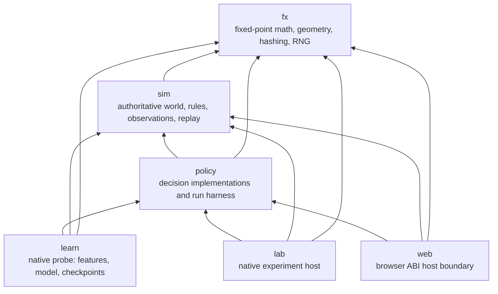

# Architecture overview

**Purpose:** Map the current crate boundaries, dependency edges, and sources of authority.
**Status:** current
**Canonical source:** [workspace manifest](../../Cargo.toml) and the five crate manifests under [`crates/`](../../crates/)
**Update when:** A crate, dependency edge, or ownership boundary changes.

## Current crate graph

Every arrow below is a direct path dependency in a `Cargo.toml`. There are no
registry dependencies behind any of these edges.

The shorthand dependency direction is `fx <- sim <- policy <- {learn, lab, web}`;
the diagram also shows the direct utility edges from `policy`, `learn`, `lab`, and
`web` that the manifests declare. `learn` is native-only and must stay unreachable
from `web`: it uses `std::thread::scope` and does not build for
`wasm32-unknown-unknown`.

## Authority by layer

- [`fx`](../../crates/fx/src/lib.rs) owns deterministic primitives: 16.16
  fixed-point arithmetic, vectors, angles, hashing, and counter-based random
  streams. It has no dependencies.
- [`sim`](../../crates/sim/src/lib.rs) owns the authoritative fight state and
  transition rules. It knows neither policies nor either host. A `World` is
  driven through observations, commands, orders, objectives, and ticks.
- [`policy`](../../crates/policy/src/lib.rs) owns decision strategies and the
  headless run loop. A policy sees an `Observation`, not a `World`, and returns
  a `Command`; it does not become authoritative simulation state.
- [`learn`](../../crates/learn/src/lib.rs) owns the v2-19 probe: a versioned
  compact feature slice, a two-layer network, an append-only discrete action
  table, a frozen checkpoint format, and the population optimizer that fills one.
  It is the only crate permitted floating point, and it is permitted it because
  nothing it computes becomes authoritative state -- what leaves it is an
  `ArticulatedCommandV1` assembled from fixed `Fx` constants by an argmax.
- [`lab`](../../crates/lab/src/main.rs) owns native experiments, verification,
  benchmarks, duels, and evolution. It is a host of the lower crates.
- [`web`](../../crates/web/src/lib.rs) owns the hand-written wasm ABI and the
  packed presentation frame. It is a host boundary, not a second simulation.
  The JavaScript in [`web/`](../../web/) reads that ABI and owns presentation.

This separation is why the determinism claim has a narrow subject. The same
scenario, seed, and submitted input sequence must produce the same `World` on
every supported target. A policy may use non-portable computation in the
future because replay records its resulting commands rather than re-running it.

## Data crossing boundaries

The simulation exposes subject-scoped `Observation` values to a driver. The
driver selects a policy, obtains one `Command`, and submits it back for that
entity. The driver may also set faction-wide `Order` and `Objective` inputs.
`World::step` alone advances authoritative time. Snapshots and the wasm frame
are outward-facing views; neither is fed back into the simulation.

The browser has an additional compatibility boundary: the Rust frame writer,
JavaScript reader, wasm equality checker, and layout comments must agree on the
packed frame version and offsets. That ABI is independent of Rust crate
dependency direction.

> **Proposed by v2 — not current:** The v2 plans discuss articulated actors,
> versioned policy and replay envelopes, and new learned-policy artifacts.
> Those are proposals, not nodes or edges in the current graph above. See the
> [v2 overview](../plans/v2-00-overview.md) for the planned sequence.

## Source anchors

- Workspace membership and profiles: [`Cargo.toml`](../../Cargo.toml)
- Direct dependencies: [`fx`](../../crates/fx/Cargo.toml),
  [`sim`](../../crates/sim/Cargo.toml),
  [`policy`](../../crates/policy/Cargo.toml),
  [`lab`](../../crates/lab/Cargo.toml), and
  [`web`](../../crates/web/Cargo.toml)
- Simulation public seam: [`crates/sim/src/lib.rs`](../../crates/sim/src/lib.rs)
- Policy public seam: [`crates/policy/src/lib.rs`](../../crates/policy/src/lib.rs)
- Browser ABI: [`crates/web/src/lib.rs`](../../crates/web/src/lib.rs)

