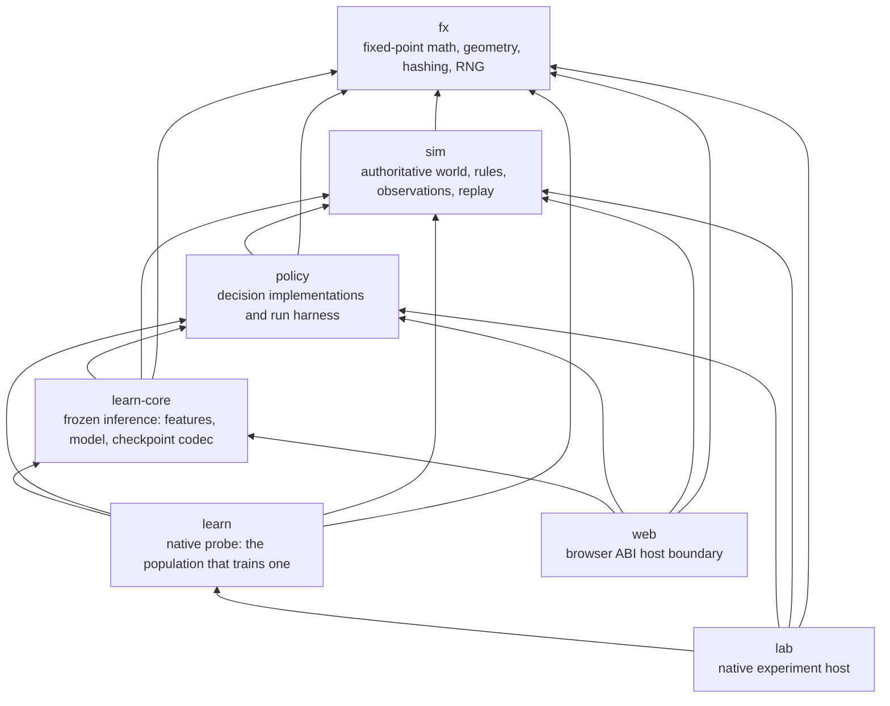

# Architecture overview

**Purpose:** Map the current crate boundaries, dependency edges, and sources of authority.
**Status:** current
**Canonical source:** [workspace manifest](../../Cargo.toml) and the five crate manifests under [`crates/`](../../crates/)
**Update when:** A crate, dependency edge, or ownership boundary changes.

## Current crate graph

Every arrow below is a direct path dependency in a `Cargo.toml`. There are no
registry dependencies behind any of these edges.

The shorthand dependency direction is
`fx <- sim <- policy <- {learn-core, lab, web}`; the diagram also shows the
direct utility edges from `policy`, `learn-core`, `learn`, `lab`, and `web` that
the manifests declare.

`learn-core` and `learn` are one crate split in two, and the line between them is
an artifact boundary. `learn-core` is frozen inference and a checkpoint codec: it
is `web`'s dependency and a trained fighter therefore runs in the browser. `learn`
is the trainer, it uses `std::thread::scope` and a wall clock, and its one host is
native `lab`.

**The boundary is not enforced by the compiler and it never was.** `AGENTS.md`
carried the reason as "`learn` does not compile to `wasm32-unknown-unknown`"; that
was measured on 2026-08-11 and is false, because `std::thread::scope` and
`std::time::Instant` compile for that target and trap at runtime instead. What
enforces the boundary is the manifests, and
`the_learned_policy_is_unreachable_from_sim` walks them: `fx`, `sim` and `policy`
may reach neither crate, and `web` reaches `learn-core` and not `learn`.

## Authority by layer

- [`fx`](../../crates/fx/src/lib.rs) owns deterministic primitives: 16.16
  fixed-point arithmetic, vectors, angles, hashing, and counter-based random
  streams. It has no dependencies.
- [`sim`](../../crates/sim/src/lib.rs) owns the authoritative fight state and
  transition rules. It knows neither policies nor either host. A `World` is
  driven through observations, commands, orders, objectives, and ticks.
- [`policy`](../../crates/policy/src/lib.rs) owns decision strategies and the
  headless run loop. A policy sees an `Observation`, not a `World`, and returns
  a `Command`; it does not become authoritative simulation state.
- [`learn-core`](../../crates/learn-core/src/lib.rs) owns frozen inference: a
  versioned compact feature slice, a two-layer network, an append-only discrete
  action table, and the checkpoint format that freezes all three together. It
  and `learn` are the two crates permitted floating point, and they are
  permitted it because nothing they compute becomes authoritative state -- what
  leaves them is an `ArticulatedCommandV1` assembled from fixed `Fx` constants
  by an argmax. `learn-core` is the one of the two that ships to a browser, and
  `LEARNED_INFERENCE_DIGEST` is what holds its arithmetic to the same answer on
  both targets.
- [`learn`](../../crates/learn/src/lib.rs) owns the v2-19 probe's other half:
  the population optimizer that fills a checkpoint, the rollouts it scores and
  the corpora it scores them on. It needs threads and a clock, so **`lab` is its
  only host** and `web` must never reach it.
- [`lab`](../../crates/lab/src/main.rs) owns native experiments, verification,
  benchmarks, duels, and evolution, and is the only host `learn` has. No
  learned weight becomes authoritative state through it: `lab learn-probe` and
  `lab trace --policy learned` are not a second simulation, they drive the same
  `World` through the same `ArticulatedCommandV1` a script does.
- [`web`](../../crates/web/src/lib.rs) owns the hand-written wasm ABI and the
  packed presentation frame. It is a host boundary, not a second simulation.
  The JavaScript in [`web/`](../../web/) reads that ABI and owns presentation.
  Since v2-ui-08 it also holds a fetched checkpoint and builds a fighter out of
  it, which is the one edge into `learn-core` and is the reason that crate
  exists apart from `learn`.

This separation is why the determinism claim has a narrow subject. The same
scenario, seed, and submitted input sequence must produce the same `World` on
every supported target. A policy may use non-portable computation in the
future because replay records its resulting commands rather than re-running it.

## Data crossing boundaries

The simulation exposes subject-scoped `Observation` values to a driver. The
driver selects a policy, obtains one `Command`, and submits it back for that
entity. The driver may also set faction-wide `Order` and `Objective` inputs.
`World::step` alone advances authoritative time. Snapshots and the wasm frame
are outward-facing views; neither is fed back into the simulation.

The browser has an additional compatibility boundary: the Rust frame writer,
JavaScript reader, wasm equality checker, and layout comments must agree on the
packed frame version and offsets. That ABI is independent of Rust crate
dependency direction.

Articulated actors, replay codec V2, and learned inference are current parts of this
graph. Their boundary remains the submitted command: floating-point inference chooses
five discrete heads, `learn-core` assembles the corresponding fixed-point constants,
and only that `ArticulatedCommandV1` crosses into `sim`. Replay stores the accepted
command, so playback reaches neither policy nor model.

## Source anchors

- Workspace membership and profiles: [`Cargo.toml`](../../Cargo.toml)
- Direct dependencies: [`fx`](../../crates/fx/Cargo.toml),
  [`sim`](../../crates/sim/Cargo.toml),
  [`policy`](../../crates/policy/Cargo.toml),
  [`lab`](../../crates/lab/Cargo.toml), and
  [`web`](../../crates/web/Cargo.toml)
- Simulation public seam: [`crates/sim/src/lib.rs`](../../crates/sim/src/lib.rs)
- Policy public seam: [`crates/policy/src/lib.rs`](../../crates/policy/src/lib.rs)
- Browser ABI: [`crates/web/src/lib.rs`](../../crates/web/src/lib.rs)

