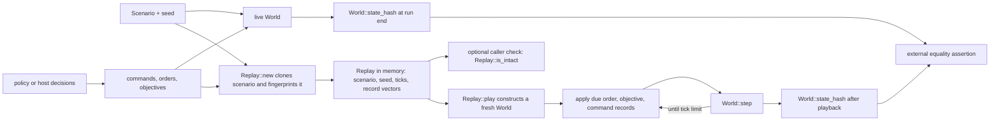

# Replay and hashing

**Purpose:** Describe the current in-memory replay path and the two existing hash uses.
**Status:** current
**Canonical source:** [`Replay`](../../crates/sim/src/replay.rs), [`Scenario::fingerprint`](../../crates/sim/src/scenario.rs), and [`World::state_hash`](../../crates/sim/src/world.rs)
**Update when:** Replay records or playback order change, either hash byte stream changes, or a persistent replay format is introduced.

## Current replay flow

Replay records inputs, not policy execution. The recorder clones the `Scenario`
and stores its seed and fingerprint, then appends each submitted per-entity
`Command`, faction `Order`, and faction `Objective` with a tick. `finish` stores
the number of ticks reached. Playback constructs a fresh `World` from the
cloned scenario and seed, applies due orders, then due objectives, then due
commands, and calls `World::step` until the stored limit.

Within each vector, playback assumes recorder order. At a tick, orders are
applied before objectives because an `Objective::Order` reads the standing
order. Both are applied before the stop check; commands are applied after that
check and before the step. No policy or observation is consulted during
playback.

`Replay::is_intact` compares the current fingerprint of its public, cloned
scenario with the value captured at construction. `play` does not call
`is_intact` and does not reject malformed, unsorted, or otherwise edited public
record vectors. The exact-replay guarantee therefore describes replays built
through the recorder methods and kept intact; tests and callers perform the
final state-hash comparison.

## The current `Replay` is not a file format

`Replay` is an unversioned Rust struct held in memory. There is no binary or
text codec, magic value, schema version, compatibility policy, decoder, or
validation pass. It embeds a full cloned `Scenario`. It is suitable for the
run harness and tests, not a browser save format or a durable interchange
contract.

Its input vocabulary is also narrower than every current host mutation:
commands, orders, and objectives are recorded, while browser editing mutators
are not. A caller that changes bodies, stats, loadouts, or other world state
outside those inputs cannot expect the current replay to reproduce that edit.

## Scenario fingerprint

`Scenario::fingerprint` identifies the starting setup for replay integrity. It
currently writes the scenario name, dungeon dimensions and dungeon digest,
maximum tick count, optional portal, and for each unit its body kind, faction,
stats, and spawn position. Torch placement is deliberately omitted because it
is presentation-only.

There is one additional, accidental current omission: `UnitSpec::loadout` is
not written. Two scenarios that differ only in a unit's loadout therefore have
the same scenario fingerprint even though the resulting worlds can behave
differently. `Replay::is_intact` cannot detect that difference. This is a
current limitation, not a compatibility promise.

## World state hash

`World::state_hash` owns the canonical byte order for a live deterministic
state. It writes the seed and tick; arena and dungeon state; door pressure;
orders and objectives; every allocated entity slot's liveness, generation,
body, health, velocity, hand, loadout, stats, cached body values, decision and
combat clocks, damage accounting, and persistent command; then every allocated
projectile slot and its state. The implementation includes dead allocated slots
so allocation history cannot disappear from the comparison.

Derived or ephemeral collections such as events, pending-decision and
navigation caches, per-tick scratch, and free-list bookkeeping are not separate
hash inputs. This prose is a guide to ownership, not an alternative hash
specification: changing the exact calls or order in `World::state_hash` changes
the hash stream and must be reviewed against the repository's golden hashes.

Both scenario fingerprints and world state hashes use `fx::Hash64`, but the
current streams have no explicit schema version or domain prefix. Golden state
hashes test simulation behavior, and native/wasm comparisons test target
equality; neither makes the in-memory `Replay` a versioned serialization.

> **Proposed by v2 — not current:** The v2 plans add explicit hash domains and
> schema versions, fix loadout coverage, and define a validated replay codec.
> None of those envelope or decoder guarantees applies to the current flow
> drawn above. See the [v2 overview](../plans/v2-00-overview.md).

## Source anchors

- Record types, recorder methods, integrity check, and playback order:
  [`Replay`](../../crates/sim/src/replay.rs#L57)
- Scenario fields and current fingerprint byte stream:
  [`Scenario::fingerprint`](../../crates/sim/src/scenario.rs#L386)
- Live state hash byte stream: [`World::state_hash`](../../crates/sim/src/world.rs#L2490)
- Hash primitive: [`crates/fx/src/hash.rs`](../../crates/fx/src/hash.rs)
- Harness recording and final comparison tests:
  [`crates/policy/src/runner.rs`](../../crates/policy/src/runner.rs)
