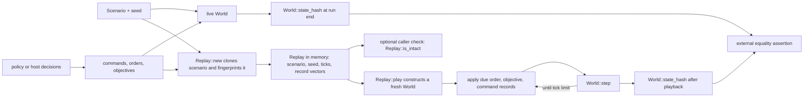

# Replay and hashing

**Purpose:** Describe the current in-memory and durable replay paths and their typed hash domains.
**Status:** current
**Canonical source:** [`Replay`](../../crates/sim/src/replay.rs), [`ReplayEnvelope`](../../crates/sim/src/codec.rs), [`Scenario::fingerprint`](../../crates/sim/src/scenario.rs), and [`World::state_hash`](../../crates/sim/src/world.rs)
**Update when:** Replay records, codec validation, playback order, or either hash byte stream changes.

## Current replay flow

Replay records inputs, not policy execution. The recorder clones the `Scenario`
and stores its seed and fingerprint, then appends each submitted per-entity
legacy `Command` or versioned `SubmittedCommand`, faction `Order`, and faction `Objective` with a tick. Exactly one command vector is active, selected by the scenario's combat model. `finish` stores
the number of ticks reached. Playback constructs a fresh `World` from the
cloned scenario and seed, applies due orders, then due objectives, then due
commands, and calls `World::step` until the stored limit.

Within each vector, playback assumes recorder order. At a tick, orders are
applied before objectives because an `Objective::Order` reads the standing
order. Both are applied before the stop check; commands are applied after that
check and before the step. No policy or observation is consulted during
playback.

`Replay::is_intact` compares the current fingerprint of its public, cloned
scenario with the value captured at construction. The legacy in-memory
`Replay::play` remains source-compatible and assumes recorder-built vectors.
Durable callers use `ReplayEnvelope::play`, which revalidates duplicate fields,
the model/domain/schema tuple, inactive command vector, scenario bounds and identity, record ordering,
tick limits, and entity identities before constructing a `World`.

## Durable replay envelope

`Replay` remains an unversioned Rust struct held in memory. `ReplayEnvelope` is the
durable boundary: a dependency-free, little-endian, bounds-checked `ARPG` file with
an outer codec version, command schema, typed hash domain/schema, complete scenario,
and fixed input streams. Decode scans the complete scenario and streams through EOF
before allocating final values. Codec V1 remains readable and frozen; codec V2
adds the scenario-owned combat-spec extension. Exact bytes and caps live in
[`replay-codec-v1.md`](../reference/replay-codec-v1.md) and
[`replay-codec-v2-combat-specs.md`](../reference/replay-codec-v2-combat-specs.md).

Its input vocabulary is also narrower than every current host mutation:
legacy or versioned submitted commands, orders, and objectives are recorded,
while browser editing mutators are not. A caller that changes bodies, stats,
loadouts, or other world state
outside those inputs cannot expect the current replay to reproduce that edit.

## Scenario fingerprint

`Scenario::fingerprint` identifies the starting setup for replay integrity. A
legacy scenario writes the tagged ScenarioV1 grammar: combat model, length-delimited name,
complete row-major dungeon bytes, maximum tick count, optional portal, and for
each unit its body kind, faction, stats, spawn position, loadout, and the full
compiled definition of each equipped action. Torch placement is deliberately
omitted because it is presentation-only. A non-legacy scenario writes ScenarioV2:
the same identity fields plus the exact codec-V2 combat-spec extension. The checked
entry point rejects both an overlong name and invalid combat construction.

## World state hash

`World::state_hash` preserves the canonical LegacyV1 byte order for a live
legacy state. Its private core writer writes the seed and tick; arena and dungeon state; door pressure;
orders and objectives; every allocated entity slot's liveness, generation,
body, health, velocity, hand, loadout, stats, cached body values, decision and
combat clocks, damage accounting, and persistent command; then every allocated
projectile slot and its state. The implementation includes dead allocated slots
so allocation history cannot disappear from the comparison.

Derived or ephemeral collections such as events, pending-decision and
navigation caches, per-tick scratch, and free-list bookkeeping are not separate
hash inputs. This prose is a guide to ownership, not an alternative hash
specification: changing the exact calls or order in the legacy core changes
the hash stream and must be reviewed against the repository's golden hashes.

`World::state_digest` carries domain, schema, and value. LegacyV1 schema 1 wraps
the unchanged state hash. The non-legacy schema 1 uses its tagged prefix and the
legacy core digest followed by the allocated-slot stored-command block. Each
present command contributes its variant tag and canonical 53-byte payload; dead
allocated slots retain the value and reused slots clear it. The suffix then writes
the exact scenario combat-spec extension, followed for every allocated entity slot
by anatomy, carrying-slot IDs, and resolved left/right bindings. Dead slots retain
those immutable rows and reused slots replace them. Typed comparison rejects domain
or schema mismatch. V2-13 appends body yaw, both complete arm rows, both grips,
derived shield pose, and movement/turn/arm authority factors for every allocated
slot. Playback submits equal-tick non-legacy records in insertion order before the
step; grip mutation occurs during the step, so pending submissions never chain.
Golden state hashes still test simulation behavior, and native/wasm comparisons
still test target equality. The envelope supplies transport and identity; it does
not replace the final typed state-digest comparison.

## Source anchors

- Record types, recorder methods, integrity check, and playback order:
  [`Replay`](../../crates/sim/src/replay.rs#L64)
- Durable codec and mandatory playback validation:
  [`ReplayEnvelope`](../../crates/sim/src/codec.rs#L175)
- Scenario fields and current fingerprint byte stream:
  [`Scenario::fingerprint`](../../crates/sim/src/scenario.rs#L452)
- Live state hash byte stream: [`World::state_hash`](../../crates/sim/src/world.rs#L4900)
- Hash primitive: [`crates/fx/src/hash.rs`](../../crates/fx/src/hash.rs)
- Harness recording and final comparison tests:
  [`crates/policy/src/runner.rs`](../../crates/policy/src/runner.rs)
