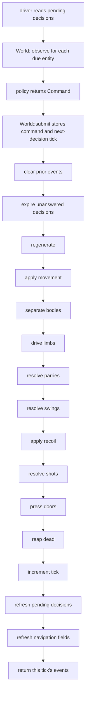

# Simulation architecture

**Purpose:** Describe the current authoritative `World`, decision boundary, and tick order.
**Status:** current
**Canonical source:** [`World`](../../crates/sim/src/world.rs) and the public simulation types re-exported by [`sim`](../../crates/sim/src/lib.rs)
**Update when:** `World` ownership, decision scheduling, or the order of any tick phase changes.

## What `World` owns

`World` is a headless structure-of-arrays simulation over generational entity
slots. It owns the seed and tick; arena and dungeon state; faction orders and
objectives; bodies, statistics, health, movement, one hand and one loadout per
entity; persistent commands and decision clocks; projectiles; door pressure;
and the bookkeeping needed to advance them. It contains no clock, thread,
renderer, policy, or mutable RNG stream.

Entity identity is `(index, generation)`. Dead slots remain in the arrays and
may be reused with a new generation, so an index alone is not an identity.
Iteration and tie breaks use stable ascending slot order.

Random perception is derived when needed with a counter-based stream keyed by
the world seed, tick, and entity identity. It is not stored as evolving world
state, so observing one entity cannot change the result of observing another.

## Driver and decision boundary

Before a tick, a driver reads `World::pending_decisions()`. For each due entity
it calls `World::observe(id)`, hands that value to a policy, and submits the
returned `Command` with `World::submit(id, command)`. `submit` also schedules
the entity's next decision. A command persists between decision ticks; a driver
that does not answer a pending decision leaves the old command in force, and
`step` advances that entity's decision clock.

An `Observation` is a subject-scoped view, not a snapshot of `World`. Own-body,
order, objective, and navigation values needed by the subject are exact;
contacts are bounded and perception-degraded. Policies therefore cannot read
or mutate authoritative storage directly.

## One tick, in current order

The phase order is executable behavior and branches on the scenario combat model.
In Legacy, bodies settle before
hands are driven, parries precede damaging swings, and deaths are reaped only
after every swing and projectile for the tick has resolved. These choices make
simultaneous damage and deaths symmetric. They do not remove the simulation's
fixed ascending-index order or its explicit index tie-breaks; body separation,
for example, resolves pairs sequentially in that deterministic order.

The non-legacy schedule shares clear/expiry, planar movement, body separation, doors, and
the tick tail. Between separation and doors it drives body yaw, atomically applies
the pending grip transaction, advances both arm actuators, and derives shield
geometry. V2-13 deliberately calls no legacy regeneration, limb, parry, swing,
recoil, shot, or HP-reap phase; no future contact, anatomy damage, or model-specific death lands
in later mechanical sessions. No future non-legacy schedule may differ from the
exact phase order in the current actuator reference contract.

`events` is cleared at the next step and is an outward report rather than
authoritative input. Navigation fields, pending-decision lists, free lists, and
per-tick scratch arrays are derived or reachable-state bookkeeping. The exact
state-hash byte stream is owned by `World::state_hash`, not by this prose; see
[Replay and hashing](replay-hashing.md).

## Mutation surfaces

The ordinary policy input is a per-entity `Command`. `Order` and `Objective`
are separate, faction-wide inputs set by the host. Construction from a
`Scenario` supplies the starting dungeon and roster. The web host also exposes
explicit world mutators for its editing surface; because such mutations change
state, callers that need a portable history must record an input vocabulary
that represents them. The current in-memory `Replay` records commands, orders,
and objectives only.

The non-legacy command boundary and immutable scenario-owned combat specs are
stored, hashed, and used to validate prospective equipment-grip transactions.
Persistent body-yaw and arm actuators participate in the `ArticulatedV1` tick branch.
Contact, anatomy evolution, and `articulated` damage do not participate yet.

## Source anchors

- Storage and construction: [`World` fields and `World::new`](../../crates/sim/src/world.rs)
- Decision seam: [`World::pending_decisions`, `World::observe`, and `World::submit`](../../crates/sim/src/world.rs)
- Tick phase order: [`World::step`](../../crates/sim/src/world.rs#L932)
- Observation shape and feature projection: [`obs.rs`](../../crates/sim/src/obs.rs)
- Command, order, and objective inputs: [`command.rs`](../../crates/sim/src/command.rs)
