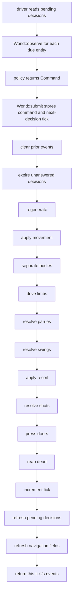

# Simulation architecture

**Purpose:** Describe the current authoritative `World`, decision boundary, and tick order.
**Status:** current
**Canonical source:** [`World`](../../crates/sim/src/world/) and the public simulation types re-exported by [`sim`](../../crates/sim/src/lib.rs)
**Update when:** `World` ownership, decision scheduling, or the order of any tick phase changes.

## What `World` owns

`World` is a headless structure-of-arrays simulation over generational entity
slots. It owns the seed and tick; arena and dungeon state; faction orders and
objectives; bodies, statistics, health, movement, one hand and one loadout per
entity; persistent commands and decision clocks; projectiles; door pressure;
and the bookkeeping needed to advance them. It contains no clock, thread,
renderer, policy, or mutable RNG stream.

Entity identity is `(index, generation)`. Dead slots remain in the arrays and
may be reused with a new generation, so an index alone is not an identity.
Iteration and tie breaks use stable ascending slot order.

Random perception is derived when needed with a counter-based stream keyed by
the world seed, tick, and entity identity. It is not stored as evolving world
state, so observing one entity cannot change the result of observing another.

## Driver and decision boundary

Before a tick, a driver reads `World::pending_decisions()`. For each due entity
it calls `World::observe(id)`, hands that value to a policy, and submits the
returned `Command` with `World::submit(id, command)`. `submit` also schedules
the entity's next decision. A command persists between decision ticks; a driver
that does not answer a pending decision leaves the old command in force, and
`step` advances that entity's decision clock.

An `Observation` is a subject-scoped view, not a snapshot of `World`. Own-body,
order, objective, and navigation values needed by the subject are exact;
contacts are bounded and perception-degraded. Policies therefore cannot read
or mutate authoritative storage directly.

## One tick, in current order

The phase order is executable behavior and branches on the scenario combat model.
In Legacy, bodies settle before
hands are driven, parries precede damaging swings, and deaths are reaped only
after every swing and projectile for the tick has resolved. These choices make
simultaneous damage and deaths symmetric. They do not remove the simulation's
fixed ascending-index order or its explicit index tie-breaks; body separation,
for example, resolves pairs sequentially in that deterministic order.

The non-legacy schedule shares clear/expiry, planar movement, body separation, doors, and
the tick tail. It retains every slot's contact tick-entry pose *before* movement and
records intended locomotion *between* movement and separation, because that
displacement exists on its own at no other point in the tick. Between separation and
doors it drives body yaw, atomically applies the pending grip transaction, advances
both arm actuators, derives shield geometry, and then resolves contact. The complete
order is pinned by a phase trace rather than argued from the reading order of the
branch: `retain contact entry`, `apply articulated movement`,
`record contact locomotion`, `separate`, `body yaw`, `grips`, `arms`, `geometry`,
`contact`, `doors`. The non-legacy branch deliberately calls no legacy
regeneration, limb, parry, swing, recoil, shot, or HP-reap phase; anatomy damage and
model-specific death land in later mechanical sessions. No future non-legacy schedule
may differ from the exact phase order in the current actuator reference contract.

`events` is cleared at the next step and is an outward report rather than
authoritative input. Navigation fields, pending-decision lists, free lists, and
per-tick scratch arrays are derived or reachable-state bookkeeping. The exact
state-hash byte stream is owned by `World::state_hash`, not by this prose; see
[Replay and hashing](replay-hashing.md).

## Mutation surfaces

The ordinary policy input is a per-entity `Command`. `Order` and `Objective`
are separate, faction-wide inputs set by the host. Construction from a
`Scenario` supplies the starting dungeon and roster. The web host also exposes
explicit world mutators for its editing surface; because such mutations change
state, callers that need a portable history must record an input vocabulary
that represents them. The current in-memory `Replay` records commands, orders,
and objectives only.

The non-legacy command boundary and immutable scenario-owned combat specs are
stored, hashed, and used to validate prospective equipment-grip transactions.
Persistent body-yaw and arm actuators participate in the `ArticulatedV1` tick branch,
and so does contact, complete: the entry velocity clamp, the collider build, the
bounded group solve, the impulse commit, one wall settlement per changed body, and the
cap commit. Body velocity, body position, both arm rows, the shield pose, and the
global `cap_hits` counter are all authoritative outputs of the phase, and completed
resolutions are published beside them as evidence rather than as a second authority.
The solver is handed collider scratch and never a world column, so a mid-tick
`ResolutionError` costs the tick its contact and leaves no half-written body. Anatomy
evolution and `articulated` damage do not participate: v2-14 mutates no HP.

## The module tree, and what measuring first saved

`crates/sim/src/world/` is a module tree whose members are named for the tick phase group
each one owns, with `struct World` in `mod.rs`. It was one file until the two refactor
sessions that preceded the embodied model, and the numbers are worth keeping because they
are what decided the shape of the work rather than what described it afterwards.

Measured on 2026-08-17, `world.rs` was **20,470 lines, of which 12,541 were `#[cfg(test)]`
modules** -- roughly 7.9k lines of production `World` and twelve and a half thousand lines
of tests for it, in one file, with the tests for the actuator several thousand lines away
from the actuator. The split moved the tests with their code. `contact_phase.rs` is now the
largest member at about 5.9k lines, most of that its own tests.

**The obvious second and third targets turned out not to be targets, and that is the part
worth recording.** `combat/contact.rs` reads as 9,045 lines and is 2,659 lines of
production code; `combat/resolution.rs` reads as 5,623 and is 1,982. Both are ordinary.
Splitting them would have been a week of hash risk spent on files that were never the
problem, and only measuring the `#[cfg(test)]` share separated the one genuine case from
the two apparent ones.

The split cost nothing in visibility churn, for a Rust rule that decides the whole shape of
such a refactor: **a private field is visible to the defining module and all of its
descendants.** Moving `impl World` blocks into siblings while `struct World` stays in
`mod.rs` keeps every one of the ~90 private columns private and reachable. No field became
`pub(crate)`, so no new access was granted to the rest of the crate and the diff was a
move. Both sessions moved no pin, which is the only acceptance criterion a refactor should
have.

## A new variant is how a golden registry stays still

The embodied body model was added as a third `CombatModel` variant beside the two it
replaced, rather than by editing the articulated actuator in place, and the reason was
neither caution nor compatibility -- nothing in this tree has a consumer outside it.

**It was that the third variant made the pins unreachable by construction.** Every
mechanic landed inside `Embodied`, whose fixtures were new, so the pins guarding the two
older models could not move however wrong the new mechanic was. Each session could then
state *nothing moves* as a design property rather than as a hope, and any move at all was
a failed isolation to be diagnosed rather than a number to re-record.

That is the technique and not a fact about combat: when a change would otherwise reach a
frozen byte stream, add the variant, land the work where no existing fixture can reach it,
and delete the old variant in a separate session whose only acceptance criterion is that
the surviving pins agree to the byte. `CombatModel::Legacy`'s deletion is the worked
example: about 13,000 lines came out and `EMBODIED_CORPUS_DIGEST` agreed exactly, which is
what said the cut had been made in the right place.

What it costs is that both variants exist at once, with two phase schedules and two sets
of state columns, and the second cost is subtler and was paid: the older model's columns
stayed inside the surviving hash stream after its behaviour was gone, because removing them
would have moved the very pin the deletion was being checked against. Retiring those
columns is therefore a separate session with a re-record and a fight-identity proof of its
own.

## Source anchors

- Storage and construction: [`World` fields and `World::new`](../../crates/sim/src/world/mod.rs)
- Decision seam: [`World::pending_decisions` and `World::observe`](../../crates/sim/src/world/query.rs), and [`World::submit`](../../crates/sim/src/world/mod.rs)
- Tick phase order: [`World::step`](../../crates/sim/src/world/mod.rs#L1820)
- Observation shape and feature projection: [`obs.rs`](../../crates/sim/src/obs.rs)
- Command, order, and objective inputs: [`command.rs`](../../crates/sim/src/command.rs)
