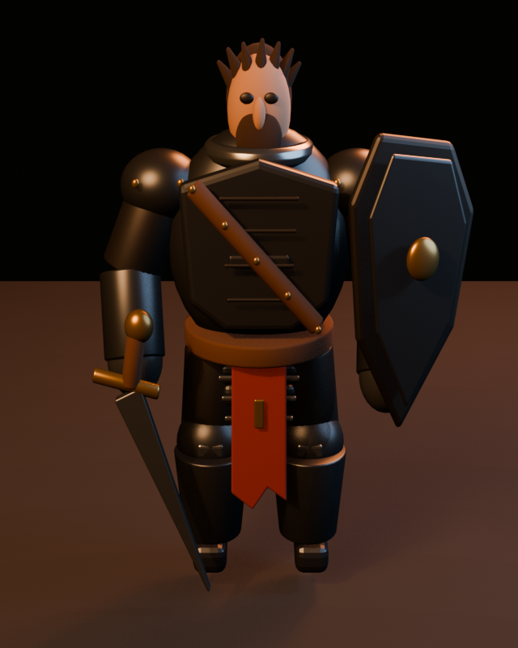

# Visual progress

Phase phase-05 starts from 0085-tall-narrow-proportion-model at 0.858136. The prior visual history is in [phase-04](../archive/phase-04/README.md).

Only the active phase keeps one tracked frame per experiment. Completed phases are
compacted according to the transition protocol.

| Stage | Candidate distance | Accepted distance after | Decision | Front render |
| --- | ---: | ---: | --- | --- |
| Phase baseline | 0.858136 | 0.858136 | starting point | [archive](../archive/phase-04/front-contact-sheet.png) |
| [0087: Hand-pivoted shield yaw](../0087-hand-pivoted-shield-yaw.md) | 0.855581 | 0.858136 | rejected | [open](0087-hand-pivoted-shield-yaw.png) |

## 0087: Hand-pivoted shield yaw (rejected)

