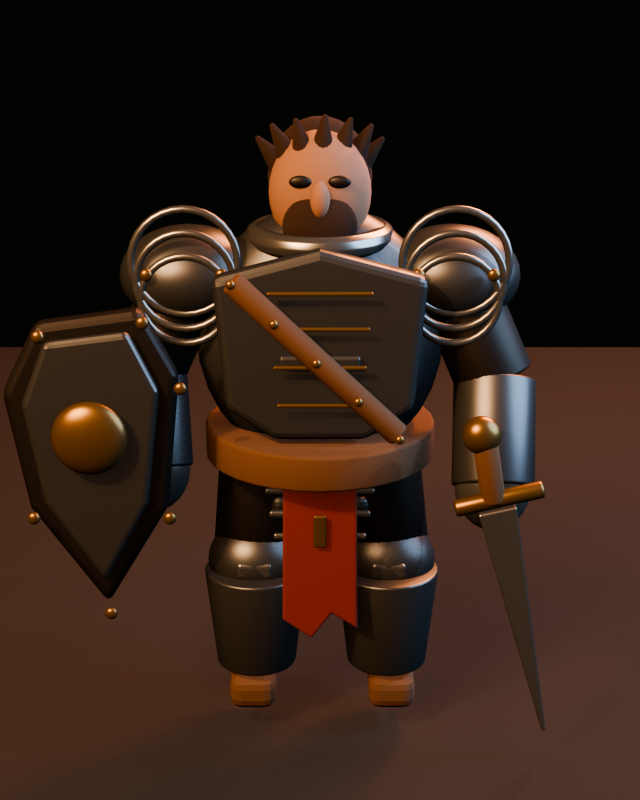
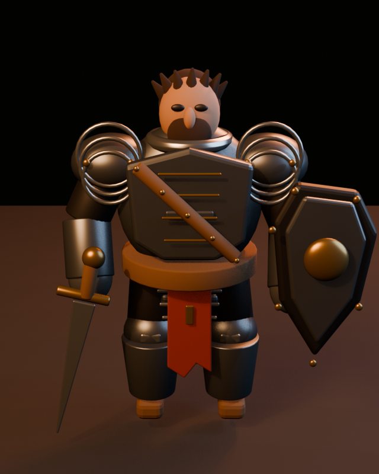

# Visual progress

Every experiment retains the same 512 x 640 front review render. Frames are
kept even for rejected experiments, with the decision shown here, so the gallery
records what was tried rather than rewriting history around successful results.

| Stage | Distance | Decision | Front render |
| --- | ---: | --- | --- |
| Initial baseline | 0.822968 | starting point | [open](0000-baseline.png) |
| [0001: mirror equipment](../0001-mirror-equipment.md) | 0.731836 | accepted | [open](0001-mirror-equipment.png) |

## Initial baseline

## 0001: Mirror equipment

