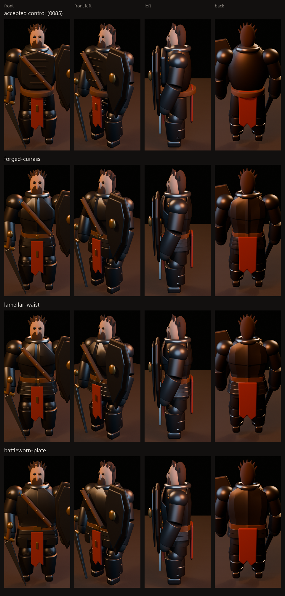
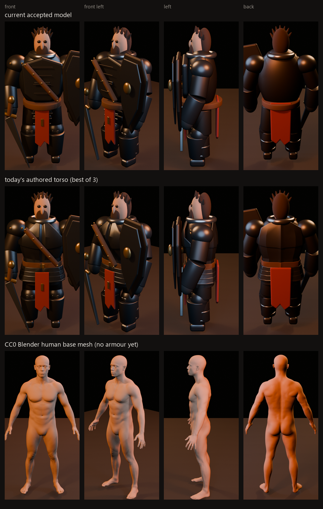
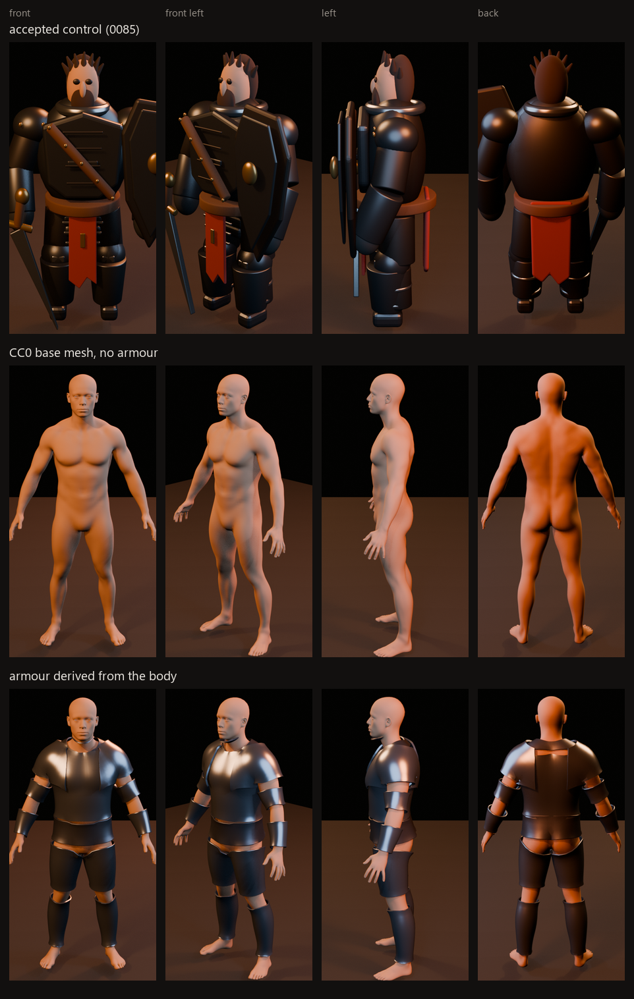

# Screening frames

Tracked visual results from work that did **not** spend a formal experiment
identifier: unscored screens, spikes, and representation trials.

The generated gallery in [the parent directory](../README.md) is written by
`similarity:experiment:decide` and holds one frame per closed experiment. It is
machine-owned, so nothing here belongs in it. This directory is hand-maintained
and is the place any other visual result must land.

The rule this directory exists for: `.review/` is ignored. A render written only
there is invisible to everyone but the process that made it, and a screen whose
images nobody can see is not a reported result. Publish here, link from the
analysis document, and `npm run check:visuals` will keep the link honest.

## Authored v3 torso-to-waist screen

Three authored torso-and-waist subsystems against the accepted control, same
camera and lighting throughout. Recorded in
[the v3 torso screen](../../../docs/analysis/authored-v3-torso-screen.md).

## CC0 human base mesh spike

The accepted control, the best authored torso, and the CC0 Blender human base
mesh with no armour on it, in the same eight-angle setup. Recorded in
[the base mesh spike](../../../docs/analysis/cc0-base-mesh-spike.md).

## Armour derived from the base mesh

The accepted control, the bare CC0 base mesh, and thirteen plates derived from
the body by its own face-set segmentation. Recorded in
[the armour fitting spike](../../../docs/analysis/armour-fitting-spike.md).

